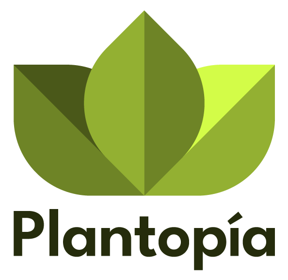

# 🌿 Plantopia - E-commerce de Plantas y Jardinería

Plataforma completa de e-commerce especializada en plantas, productos de jardinería y servicios de asesoría. Desarrollada con tecnologías modernas y arquitectura escalable.



## 📋 Descripción del Proyecto

Plantopia es una solución completa de comercio electrónico que incluye:

- **Backend API REST** - Desarrollado con NestJS 11
- **Frontend Web** - Desarrollado con Angular 20 y Tailwind CSS 4
- **Diseño Responsive** - Optimizado para todos los dispositivos
- **Paleta de Colores Natural** - Inspirada en plantas y bosques

## 🏗️ Arquitectura del Proyecto

```
plantopiaclone/
├── plantopia-backend/        # 🔙 API REST con NestJS
│   ├── src/                  # Código fuente
│   │   ├── productos/        # Módulo de productos
│   │   ├── plantas/          # Módulo de plantas
│   │   ├── usuarios/         # Módulo de usuarios
│   │   ├── ventas/           # Módulo de ventas
│   │   ├── orden-compras/    # Módulo de órdenes
│   │   └── ... (14 módulos más)
│   ├── test/                 # Tests
│   └── README.md             # Documentación del backend
│
├── plantopia-frontend/       # 🎨 Frontend con Angular 20
│   ├── src/
│   │   ├── app/
│   │   │   ├── core/         # Servicios y modelos
│   │   │   ├── features/     # Páginas principales
│   │   │   ├── layout/       # Header y Footer
│   │   │   └── shared/       # Componentes compartidos
│   │   └── styles.css        # Tailwind CSS 4
│   └── README.md             # Documentación del frontend
│
├── .gitignore               # Archivos ignorados
├── README.md                # 📄 Este archivo
└── ESTRUCTURA.md            # Documentación de estructura
```

## 🚀 Tecnologías Utilizadas

### Backend
- **NestJS 11** - Framework progresivo de Node.js
- **TypeScript 5.7** - Superset tipado de JavaScript
- **Swagger/OpenAPI** - Documentación automática de API
- **Class Validator** - Validación de datos
- **RxJS 7.8** - Programación reactiva

### Frontend
- **Angular 20** - Framework web moderno
- **Tailwind CSS 4** - Framework CSS utility-first
- **TypeScript 5.7** - JavaScript con tipos
- **Angular Signals** - Gestión de estado reactiva
- **RxJS 7.8** - Manejo de datos asíncronos

## 📋 Requisitos Previos

- **Node.js** 22.x o superior
- **npm** 10.x o superior
- **Git** para control de versiones

## 🛠️ Instalación y Configuración

### 1️⃣ Clonar el Repositorio

```bash
git clone https://github.com/ccasti10/plantopiaclone.git
cd plantopiaclone
```

### 2️⃣ Configurar Backend

```bash
cd plantopia-backend

# Instalar dependencias
npm install

# Configurar variables de entorno
cp .env.develop .env

# Iniciar servidor de desarrollo
npm run start:dev

# El backend estará disponible en http://localhost:3000
# Documentación Swagger en http://localhost:3000/api
```

### 3️⃣ Configurar Frontend

```bash
cd plantopia-frontend

# Instalar dependencias
npm install

# Iniciar servidor de desarrollo
npm start

# El frontend estará disponible en http://localhost:4200
```

## 🎨 Características del Frontend

### Páginas Implementadas
- ✅ **Página de Inicio** - Hero section, categorías, productos destacados
- ✅ **Catálogo de Productos** - Grid responsive con filtros
- ✅ **Detalle de Producto** - Galería de imágenes, información completa
- ✅ **Carrito de Compras** - Gestión de productos y cantidades
- ✅ **Checkout** - Formulario de envío y pago

### Componentes
- ✅ **Header Responsive** - Navegación adaptable con menú hamburguesa
- ✅ **Footer Completo** - Información y enlaces
- ✅ **Cards de Producto** - Diseño moderno con badges
- ✅ **Sistema de Carrito** - Persistencia en localStorage

### Diseño
- 🎨 **Paleta de Colores Natural**
  - Forest (Verde) - Colores primarios
  - Earth (Tierra) - Colores secundarios
  - Bloom (Florales) - Colores de acento
  - Stone (Neutros) - Fondos y texto
- 📱 **Responsive Design** - Mobile, Tablet, Desktop
- ✨ **Animaciones Suaves** - Transiciones y efectos hover

## 🔌 API Endpoints Principales

```
GET    /productos              # Listar productos
GET    /productos/:id          # Obtener producto
POST   /productos              # Crear producto
PUT    /productos/:id          # Actualizar producto
DELETE /productos/:id          # Eliminar producto

GET    /plantas                # Listar plantas
GET    /plantas/:id            # Obtener planta

POST   /usuarios/registro      # Registrar usuario
POST   /usuarios/login         # Iniciar sesión

GET    /orden-compras          # Listar órdenes
POST   /orden-compras          # Crear orden
```

## 📦 Módulos del Backend

1. **productos** - Gestión de productos base
2. **plantas** - Catálogo de plantas con características
3. **fertilizantes** - Productos fertilizantes
4. **sustratos** - Tipos de sustratos
5. **maceteros** - Catálogo de maceteros
6. **control-plagas** - Productos para plagas
7. **planta-cuidados** - Guías de cuidado
8. **ventas** - Gestión de ventas
9. **orden-compras** - Órdenes de compra
10. **detalle-orden-compras** - Detalles de órdenes
11. **despachos** - Gestión de despachos
12. **usuarios** - Usuarios y autenticación
13. **equipo** - Gestión del equipo
14. **comunes** - Recursos compartidos

## 🧪 Testing

### Backend
```bash
cd plantopia-backend

# Tests unitarios
npm run test

# Tests e2e
npm run test:e2e

# Cobertura
npm run test:cov
```

### Frontend
```bash
cd plantopia-frontend

# Tests unitarios
npm test

# Tests con cobertura
npm test -- --coverage
```

## 🏗️ Compilación para Producción

### Backend
```bash
cd plantopia-backend
npm run build
# Archivos en dist/
```

### Frontend
```bash
cd plantopia-frontend
npm run build
# Archivos en dist/frontend/
```

## 🚀 Despliegue

### Backend
El backend está preparado para despliegue en Koyeb:
```
https://plantopia.koyeb.app
```

### Frontend
El frontend puede desplegarse en:
- Vercel
- Netlify
- Firebase Hosting
- GitHub Pages

## 📚 Documentación Adicional

- [Backend README](./plantopia-backend/README.md)
- [Frontend README](./plantopia-frontend/README.md)
- [Estructura del Proyecto](./ESTRUCTURA.md)

## 🌳 Ramas de Desarrollo

- `main` - Rama principal de producción
- `claude/frontend-plantopia-JryPB` - Desarrollo del frontend
- `claude/update-packages-JryPB` - Actualización de paquetes

## 🤝 Contribución

1. Fork el repositorio
2. Crea una rama para tu feature (`git checkout -b feature/AmazingFeature`)
3. Commit tus cambios (`git commit -m 'Add some AmazingFeature'`)
4. Push a la rama (`git push origin feature/AmazingFeature`)
5. Abre un Pull Request

## 👥 Equipo de Desarrollo

- **Backend Team** - Desarrollo de API REST
- **Frontend Team** - Desarrollo de interfaz de usuario
- **DevOps Team** - Infraestructura y despliegue

## 📄 Licencia

Este proyecto está bajo la Licencia MIT.

## 📞 Contacto

Para soporte y consultas:
- GitHub Issues: [Reportar un problema](https://github.com/ccasti10/plantopiaclone/issues)
- Email: soporte@plantopia.com

---

**Desarrollado con 💚 por el equipo de Plantopia**
